# Отчёт по лабораторной работе № 1

## Оглавление

0. [Подготовка](#preparation)
1. [Сервис и запуск без изоляции](#baseline)
2. [Изоляция с помощью namespaces](#namespaces)
3. [Ограничение ресурсов с помощью cgroups](#cgroups)
4. [Ограничение привилегий](#privileges)
5. [Скрипт запуска и сравнение с Docker](#script)
6. [Образ, слои и сохранение данных](#images)
7. [Запуск под gVisor](#gvisor)
8. [Мониторинг и оповещения](#monitoring)
9. [Выводы](#conclusions)

## 0. Подготовка
Перед выполнением лабораторной работы был проведен небольшой ресерч о возможности выполнять нативно на mac os. 
Мотивацией к ресерчу послужил представленный в прошлом году нативный инстурмент Mac os для запуска контейнеров([репозиторий](https://github.com/apple/container)).

Оказалось, что каких-то близких аналогов для выполнения работы в mac os нету, единственным близким по смыслу является [App Sandbox](https://developer.apple.com/documentation/xcode/configuring-the-macos-app-sandbox). Официальное решение для запуска Linux контейнеров на mac os не использует встроенные механизмы системы, а создает отдельные микро вм на каждый контейнер с помощью нативного фреймворка виртуализации ([дока](https://github.com/apple/container/blob/main/docs/technical-overview.md))

По описанным выше причинам использовалась ВМ на Debian 12. Подобытным приложением выступает [нечто навайбкоженое на go](api/main.go).

## 1. Сервис и запуск без изоляции
Запустим процесс и проверим, что api работает. На рисунках ниже можно увидеть успешный запуск и проверку работы. Сам процесс был найден по признаку прослушки 8080 порта.

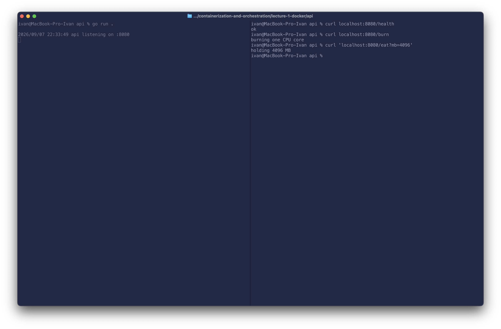
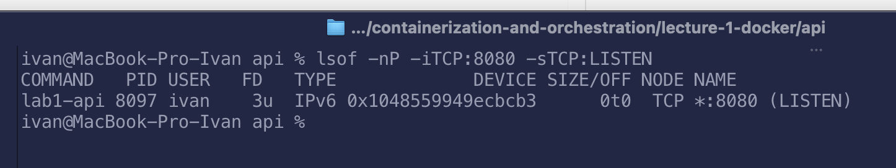

## 2. Изоляция с помощью namespaces
Для запуска процесса с изоляицей в неймспейс используется команда unshare. Путем проб и ошибок были выявлены необходимые аргументы для нормальной проверки изоляции, а именно `unshare -mpnuifr --mount-proc`. Разберем что значит каждый флаг и зачем он нужен. 

Флаги создания namespace:

- m: создание mount namespace, то есть изолирует точки монтирования
- p: создание PID namespace, внутри него процесс будет видеть себя как PID 1
- n: создание NET namespace, то есть своя сеть, интерфейсы и т.д.
- u: создание UTS namespace для изоляции имени хоста
- i: создание IPC namespace, что-то типа изоляции способов обмена данными между процессами (очередей, семафоров и  т.д) 

Остальные флаги:

- f: изолируемый процесс запускается как форк unshare, тогда дочерний процесс (то есть api) будет в новом namespace
- r: создает бинд между внешним пользователем и внутреним root. Внутри процесса пользователь будет считаться как root, но снаружи не иметь привелегий.
- mount-proc: монтирование новой /proc. Например без этого ps внутри неймспейсов будет просто показывать процессы хоста.

Запустим процесс и проверим изоляцию. Для проверки будет использоваться команда `nsenter --all` для выполнения команд в указанных namespace процесса (в данном случае во всех).

**Проверка PID namespace:** внутри процесса `api` имеет PID 1.

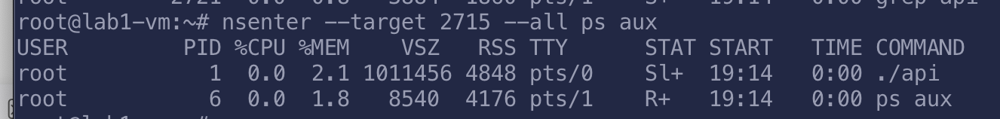

**Проверка network namespace:** внутри виден только интерфейс `lo` в состоянии DOWN, а на хосте также есть `eth0`.

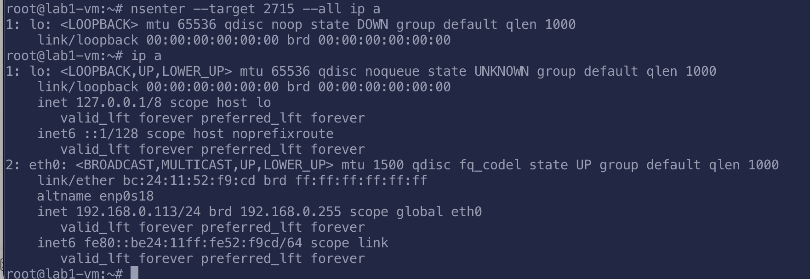

**Проверка UTS namespace:** смена имени хоста внутри процесса не влияет на настоящее имя хоста.
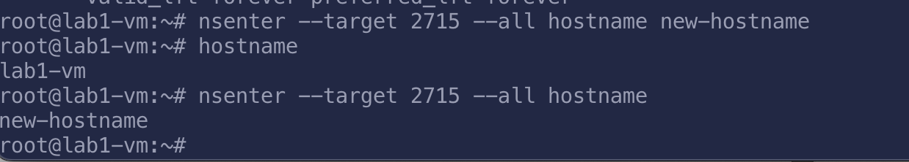

**Проверка user namespace:** внутри неймспейса пользователь root, хотя через /proc можно увидеть, что пользователь другой
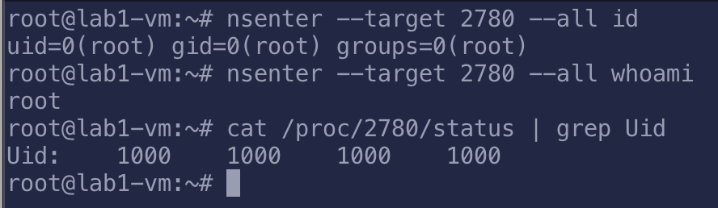

Если вдруг интересно, вот список проблем что возникали при выполнении этой части:

- сетевой интерфейс после запуска процсса `down`, постоянно надо поднимать (пока писал отчет вспомнил, что в скрипте это не учел...)
- без монтирования `/proc` не получалось проверить изоляцию PID
- без `--fork` флага процесс не помещается в namespace, потому что процессов по сути unshare является
- без `--map-root-user` вообще не зайди в неймспейс, потому что биндов пользователей и групп нет

## 3. Ограничение ресурсов с помощью cgroups
Cgroups отвечают за ограничение ресурсов. Есть V1 и V2, главное отличие: в v1 для отдельных ресурсов можно создавать отдельные группы, в v2 группа отвечает за все лимиты. В этой работе будут использоваться V2.

Cgroups можно посмотреть в `/sys/fs/cgroup` (виртуальная фс, которая не показывает реальные файлы, а скорее параметры ядра). Соотвественно для создания cgroup достаточно создать папку, после чего ядро само создаст необходимые файлы.

Были выставлены следующие лимиты
- 64мб ОЗУ: в файл memory.max записано значение `64000000`
- 0.5 CPU: записано `50000 100000` в cpu.max. Это значит, что процесс за 100мс может потратить 50мс времени процессора
- 5 форков: записано в файл pids.max

Проверим, что сигруппы работают. Для добавления процесса в cgroup можно записать его PID в `cgroup.procs` соотвествующей группы.

**Проверка лимита памяти:** было выделено 65 мбайт ОЗУ, что вызвало  OOM. Это можно отслежить в `memory.events` группы

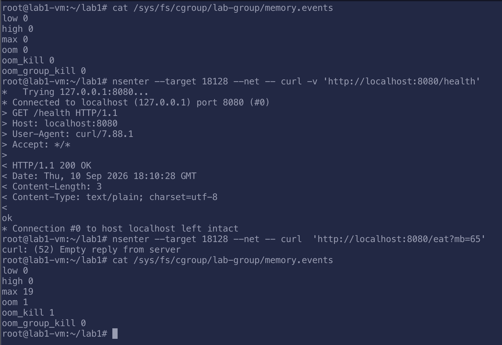

**Проверка лимита CPU:** превышение лимита CPU можно отслежить по кол-чу времени в троттлинге (лежит в `cpu.stats`)

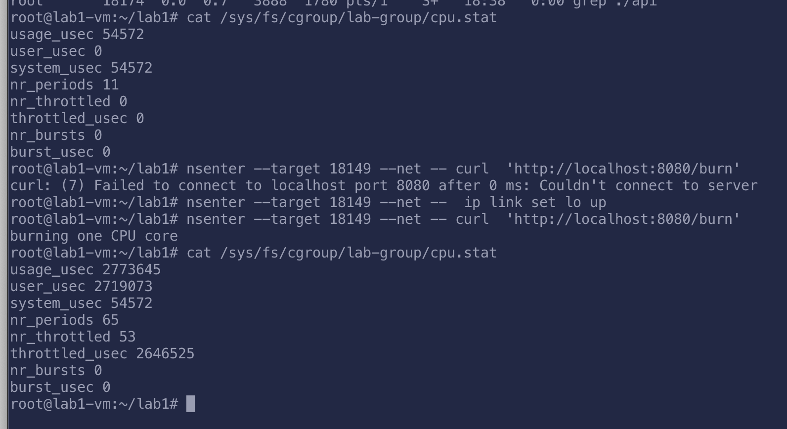

**Проверка лимита числа процессов:** После запуска форк-бомбы в `pid.events` можно наблюдать количество превышения форков.

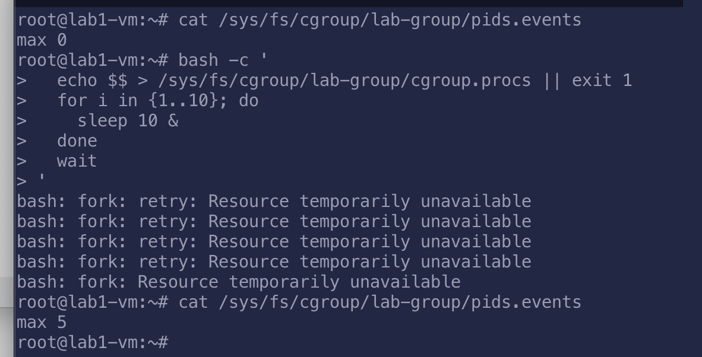

## 4. Ограничение привилегий
Capabilities позволяют ограничивать отдельные root права. Проверка происходит на уровне ядра. Проверить привелегии для процесса можно в `/proc/<pid>/status`. Для процесса есть следующие права

- Permitted: что процесс может использовать
- Effective: фактические права прямо сейчас
- Inheritable: какие права могут быть наследованы
- Bounding: максимальные доступные права
- Ambient: права, которые сохраняются при запуске без повышенных привелегий

Для работы api не нужны никакие привелигированные запросы, поэтому с помошью утилиты `setpriv` с флагами `--bounding-set=-all --inh-caps=-all --ambient-caps=-all` они будут отобраны. для демонстрации работы этого запрета попробуем запустить api, но слушать будем на порту 79 (привязка к портам ниже 1024 является привелгированным действием). Ниже можно увидеть, что запуск программы был нарушен из-за недостающих прав.

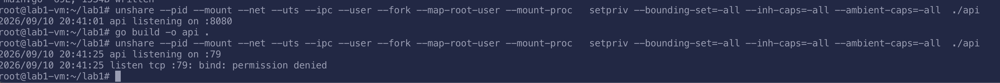

Seccomp же, в отличие от capabilities, фильтрует не только привелигированные вызовы, а впринципе системные вызовы. Параметры задаются json конфигами. За фильтрацию отвечает отдельная программа в пространстве ядре (работает за счет механимза BPF). В случае capabilities за проверку прав отвечает само ядро.

Проверка seccomp для одного процесса оказалось не самой тривиальной задачей (либо я что-то пропустил). Поиск в интернетах приводил либо к написание c++ кода, либо к применению конфига к systemd юнитам. По итогу seccomp был настроен с помошью утилиты `enosys`, которая не позволяет полноценно использовать json профили, но все еще дает воможность ограничивать вызовы с использованием seccomp. А еще в apt репозитории нет нормальной версии под Debian 12, поэтому ее пришлось ручками билдить.

Для демонстрации был запрешщен вызов bind. Как видно из рисунка, без него api действительно не может стартовать.

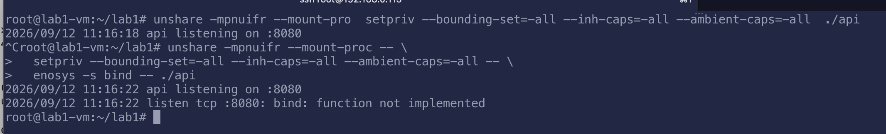
Полноценные ограничения будут введены далее на этапе написание скрипта.

## 5. Скрипт запуска и сравнение с Docker

Команды сверху были объеденены в один [скрипт](docker.sh). По работе скрипта особо нечего сказать интересного, кроме механизма чистки процессов после завершения работы. `trap` перехватывает сигналы выхода и перед их обработкой запускает функцию `cleanup`, которая удаляет cgroup (создается уникальная) и завершает созданные процессы. 

На скриншоте видно, что скрипт успешно запускает api, запрос к `/health` из его network namespace возвращает `ok`.

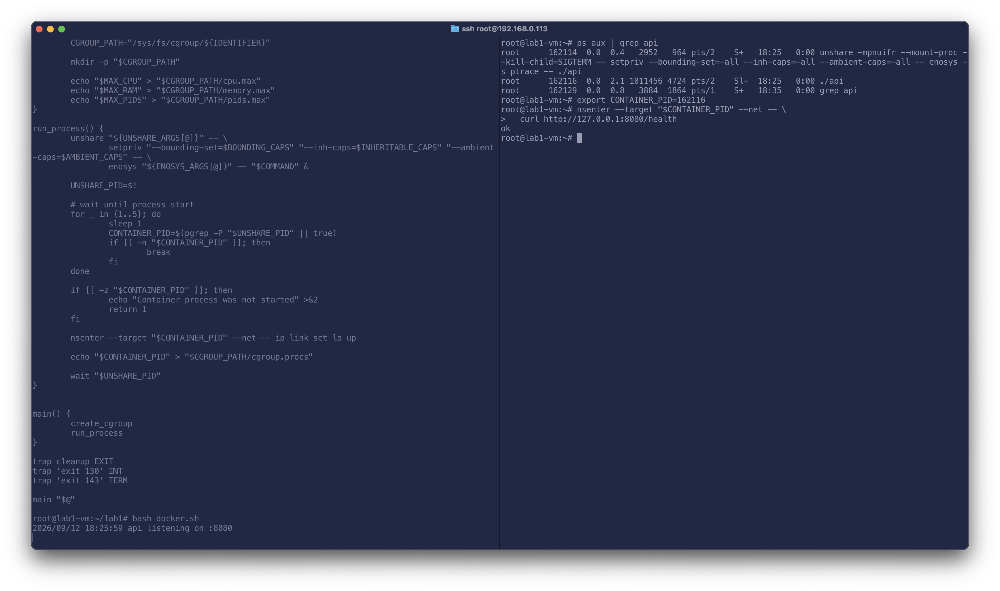

Профиль seccomp был сделан по аналогии с таковым в docker. Если кратко, то были запрешены следующие группы вызовом

- управление системой и окружением
- доступ к другим процессам
- функции ядра

Нюансы по работе скрипта

- почти все параметризовано, но менять значения через флаги нельзя
- после запуска, процессу какое-то время не присвоена cgroup, что явно не является безопасным
- seccomp профиля полноценные не применить

Чего не реализует скрипт при сравнении с docker:

- никаких настроек сети (нет режимов работы, прокидывания портов и т.д.)
- нет нормальной работы ФС (например вольюмов)
- никаких образов
- никакой информации о контейнере (статуса, логов)
- нету клиента для управления контейнерами
- нету изолированной rootfs, соотвественно в нее chroot не выполняется

То есть мой скрипт выполняет базовый запуск процесса в изолированном окружении, а docker выстраивает целую систему, которая позволяет гибко управлять контейнерами, реализуя доп. механизмы по-типу системы образов. 

## 6. Образ, слои и сохранение данных

Был написан [Dockerfile](api/Dockerfile) с двумя стадиями: в первой собирается бинарник API, во второй он запускается на базе Alpine.

## 7. Запуск под gVisor

gVisor реализует дополнительный слой защиты за счет приложения-прослойки, которое реализует большинство системных вызовов ядра Linux (компонент sentry). Для доступа к системе вне песочницы используется элемент gofer. То есть контейнеры не обращаются напрямую в ядро, между ними и ядром теперь есть прослойка, которая сама выполянет большинство вызовов. За счет этого и реализуется дополнительная изаляция.

Для проверки работы был установлен рантайм `runsc` и сконфигурирован как основной для Docker.

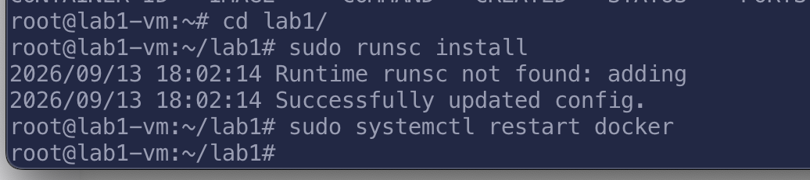

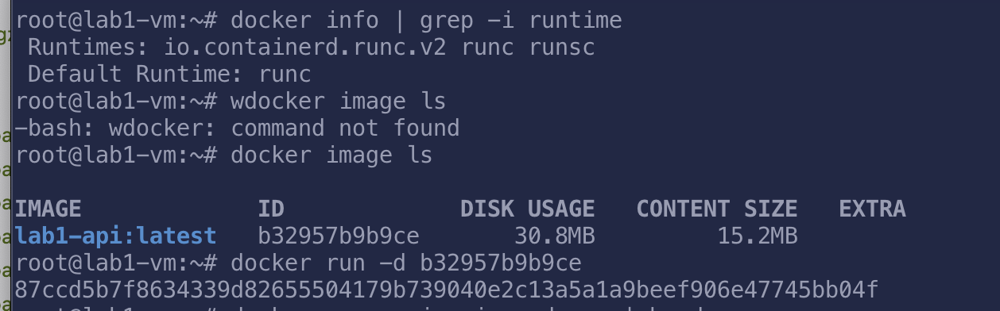

Контейнер успешно запушен с помощью `runshc рантайма`

## 8. Мониторинг и оповещения

## 9. Выводы
