# Отчёт по лабораторной работе № 3

## Оглавление

0. [Подготовка](#preparation)
1. [Ограничительные политики кластера](#guardrails)
2. [Helm-чарт для API и Worker](#chart)
3. [PostgreSQL под управлением оператора](#postgres)
4. [Отказ управляющего контура](#control-plane-failure)
5. [Мониторинг и оповещения](#monitoring)
6. [Выводы](#conclusions)

<a id="preparation"></a>
## 0. Подготовка
Был навайбкожен очередной Go-сервис. В очередной раз были использованы общий чарт и докерфайл.

Перед началом вынесем структуру `helmfile` в корень репозитория, чтобы он не был привязан к лабораторной.

По мелочи поменял лейблы для навайбкоженных API, чтобы были общие лейблы и можно было общий мониторинг сделать.

<a id="guardrails"></a>
## 1. Ограничительные политики кластера
В качестве механизма ограничения прав в кластере был выбран Kyverno, потому что он предполагает более нативный для k8s подход в виде описания политик через CRD.
Также Kyverno является частью CNCF, причём имеет Graduated maturity level.

Gatekeeper описывает правила на своём языке Rego, и этот подход не особо нативный для k8s, поэтому он меня оттолкнул.

Для деплоя Kyverno, CRD и политик создал отдельный [helmfile](../helmfile/helmfiles/policies.yaml.gotmpl).
CRD ставятся официальным чартом, для политик был сделан максимально [базовый чарт](../helmfile/charts/kyverno-policies/) — обёртка, по сути, вообще без шаблонизации.

Снизу будет список реализованных полиси.
Они применяются для неймпсейса api (куда и деплоятся все api/worker).
- [**Обязательные лимиты**](../helmfile/charts/kyverno-policies/templates/mutatingPolicy.yaml) (Mutating policy):
получает список контейнеров и навешивает дефолтные лимиты ресурсов, если они не заданы.
- [**Обязательные лейблы и запрет привилегированных контейнеров**](../helmfile/charts/kyverno-policies/templates/validatingPolicy.yaml) (Validating Policy):
не даёт поставить релиз, если нет лейблов или контейнер работает с повышенными правами.
- [**Создание дефолтной нетворк полиси**](../helmfile/charts/kyverno-policies/templates/generatingPolicy.yaml) (Generating Policy):
при создании неймспейса автоматически создаётся сетевая политика, которая запрещает прямой трафик из внешних источников.
- [**Запрет недоверенных образов**](../helmfile/charts/kyverno-policies/templates/imageValidatingPolicy.yaml) (Image Validating Policy):
не даёт ставить образы, которые не подписаны доверенным источником.
Далее будет чуть подробнее про неё.

Политика по созданию сетевой политики, конечно, не очень действенная, но какую-никакую безопасность добавляет. Навешивать дефолтные лимиты при их отсутствии тоже вряд ли является хорошей практикой,
тем более что это делается без предупреждения (потому что validating policy применяется после mutating).

В своё оправдание скажу: эти политики были реализованы таким образом, потому что хотелось попробовать разные типы policy.
Чисто по заданию как будто все правила сводятся к Validating Policy.

**Про проверку образов**

*Мотивация: хотелось потыкать Image Validating Policy*

Для проверки образов был написан простенький [github CI](../.github/workflows/images.yaml), который при изменении API запускает билд образа (правда, сразу всех и с тегом latest, но не важно).
Важно, что после билда cosign с помощью временного OIDC-токена получает временный сертификат, который связывает временный публичный ключ с GitHub Workflow.
После этого приватным ключом подписывается digest.
Вместе с образом в реджистри кладется артефакт подписи с данными для проверки.
То есть теперь мы чётко можем проверить, что образ был собран на GitHub-раннере и в конкретном репозитории на конкретной ветке.

Для проверки создал ресурс [Image Validating Policy](../helmfile/charts/kyverno-policies/templates/imageValidatingPolicy.yaml)
в котором проверяется, что образ подписан в CI из моего репозитория в любой ветке и что личность подписанта подтвердил GitHub.

```
  attestors:
    - name: cosign
      cosign:
        keyless:
          identities:
            - subjectRegExp: '^https://github\.com/kloV148/containerization-and-orchestration/\.github/workflows/images\.yaml@refs/heads/.+$'
              issuer: 'https://token.actions.githubusercontent.com'
  validations:
    # verifyImageSignatures возвращает массив кол-ва проверенных подписей, в all(e, e > 0) проверяем, что каждый образ больше 0 подписей имеет
    - expression: >-
        images.containers.map(image, verifyImageSignatures(image, [attestors.cosign])).all(e, e > 0)
      message: "failed to verify image with cosign cert"
```
Также для тегов автоматически прописывается digest.
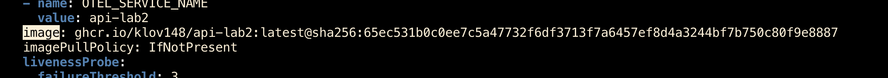

**Скриншотики работающих полиси**
Лимиты
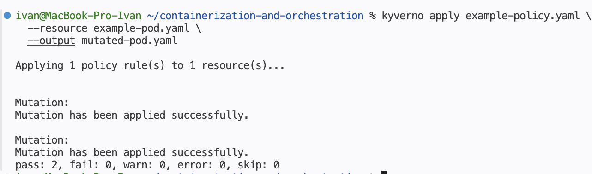
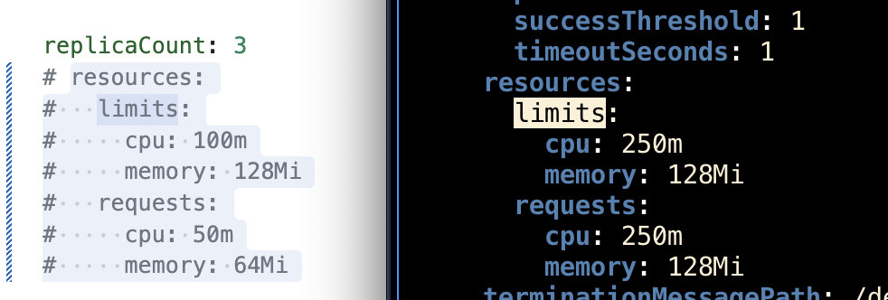

Запрет привилегированных контейнеров
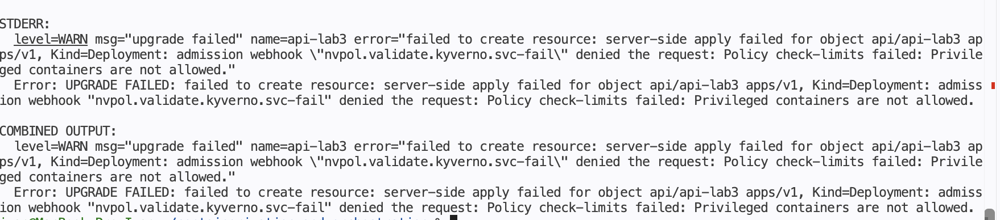

Запрет недоверенных образов
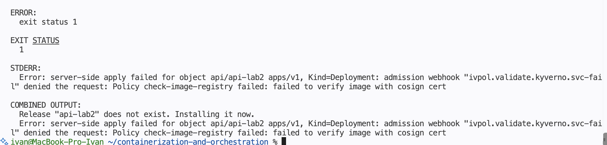

Дефолтная сетевая политика
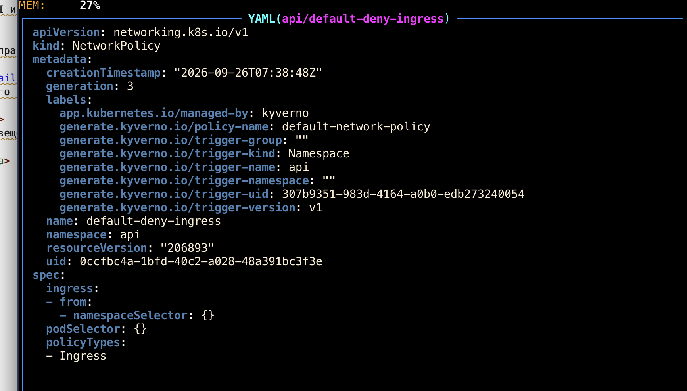

Проверка наличия лейблов
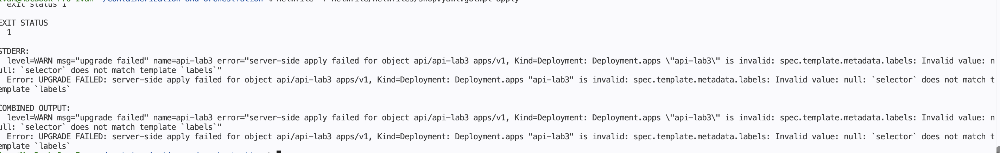


Под конец части с политиками хочется пожаловаться, что язык CEL, который Kyverno использует для выражений, мне очень не понравился.

<a id="chart"></a>
## 2. Helm-чарт для API и Worker
Ну, чарт был создан ещё в прошлой лабораторной, поэтому кратко пройдусь по тому, что доделал:
- Добавил возможность настраивать стратегии для deploy
- Добавил возможность Secret создавать и мапить из него значения

Добавим следующие параметры деплоя:
```
replicaCount: 3
strategy:
  type: RollingUpdate
  rollingUpdate:
    maxUnavailable: 0
    maxSurge: 1
```
Они говорят, что из 3 реплик должны быть доступны всегда 3 реплики, а сверх лимита можно создать один под для обновления. На картинке ниже можно увидеть, что при обновлении действительно все 3 пода доступны и создается один обновленный сверх лимита реплик.
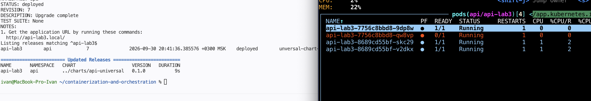

Теперь попробуем поставить заранее сломанный релиз (`HEALTH_FAIL: "true"`).
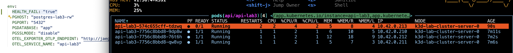
Новый под не сможет стать готовым. Старые поды удалить нельзя, потому что минимум 3 должны быть доступны.
Создать больше новых подов не позволяет параметр `maxSurge`. Тут спасёт только откат...

<a id="postgres"></a>
## 3. PostgreSQL под управлением оператора

Для установки PostgreSQL выбран CloudNativePostgres.
Были установлены CRD и написан простенький [чартик](../helmfile/charts/postgres/) для деплоя БД. Чарт был добавлен в релиз с api.
В самом чарте также создан шаблон Secret, чтобы задавать пароль.
API получает к нему доступ через следующий шаблон:
```
valueFrom:
	secretKeyRef:
		name: {{ $val.name }}
		key: {{ $val.key }}
```

Установим релиз и увидим созданный под и соответствующий ему ресурс Cluster.
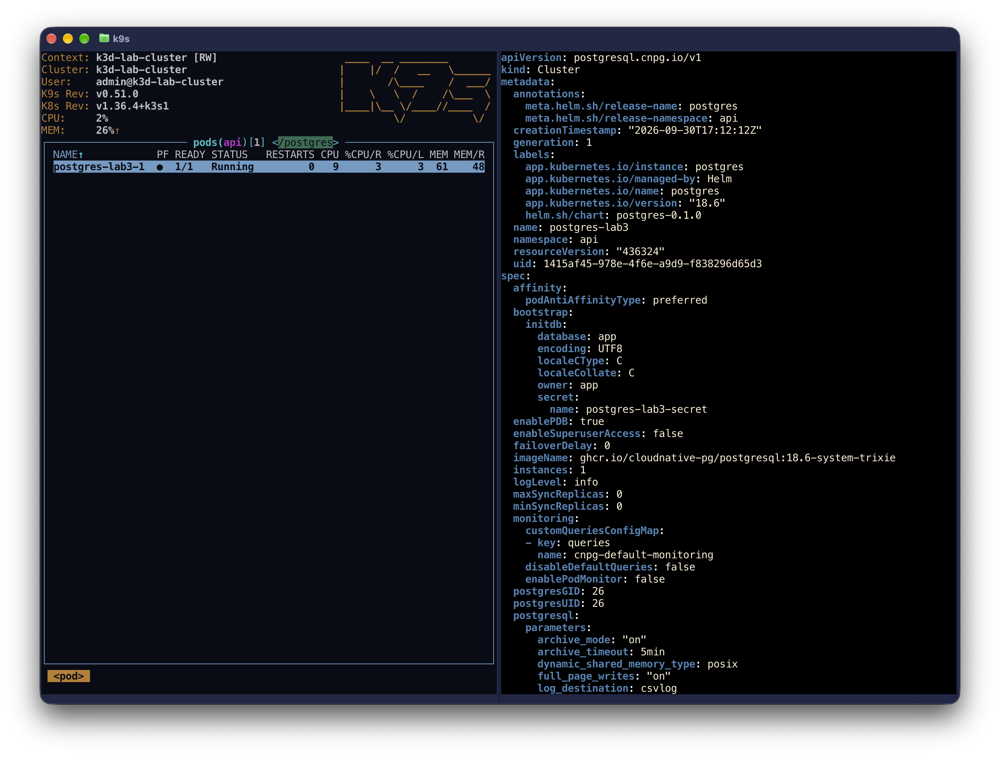

За жизненный цикл ресурса отвечает оператор, который следит за ресурсами Cluster и в соответствии с этим создаёт/ликвидирует необходимые объекты.

Для установки PostgreSQL в нужном неймспейсе была ослаблена безопасность — теперь подпись проверяется только у образов с GitHub, остальные ну просто не проверяются...
## 4. Отказ управляющего контура
Создадим worker-ноду и запретим деплой на master-ноде:
`kubectl cordon k3d-lab-cluster-server-0`
Для проверки остановим master-ноду.
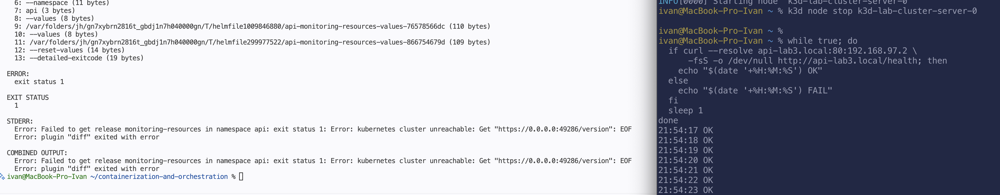

Хелсчек проходит, но релизы не применяются.

После восстановления master-ноды всё снова применяется.

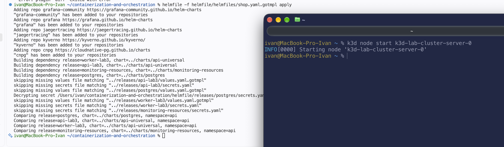

<a id="monitoring"></a>
## 5. Мониторинг и оповещения
По своей дурости в прошлой лабораторной я не использовал `kube-prom-stack`, исправим это.
Были поставлены CRD, а вместе с ними — встроенные Alertmanager и Grafana.

Алерты и фильтры мониторинга были слегка изменены для переиспользования в следующих работах.
Для деплоя кастомных ресурсов, связанных с мониторингом, был написан yet another простенький [хельм чарт](../helmfile/charts/monitoring-resources/). Он рассчитан на деплой:
-  ServiceMonitor
- PrometheusRule
- Конфигмапы для провиженинга Grafana

[Тут](../helmfile/releases/monitoring-resources/values.yaml) можно посмотреть конфигурацию алертов и мониторинга.
Если кратко, то все ресурсы с лейблом `app.kubernetes.io/part-of: shop` мониторятся по порту http.

Кроме того, был закрыт бэклог из прошлой работы, а именно:
- Провиженинг Grafana: пароль задаётся заранее, и дашборд сразу импортируется из configmap (это было сделано после утери дашборда....)
- Общее правило алертов по лейблам
- С помощью Dashboard Variables графики автоматически создаются для каждого api и worker

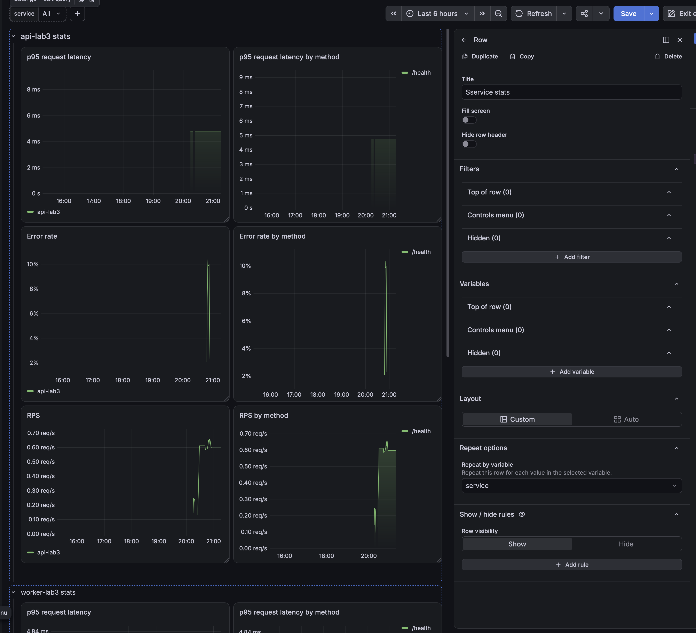
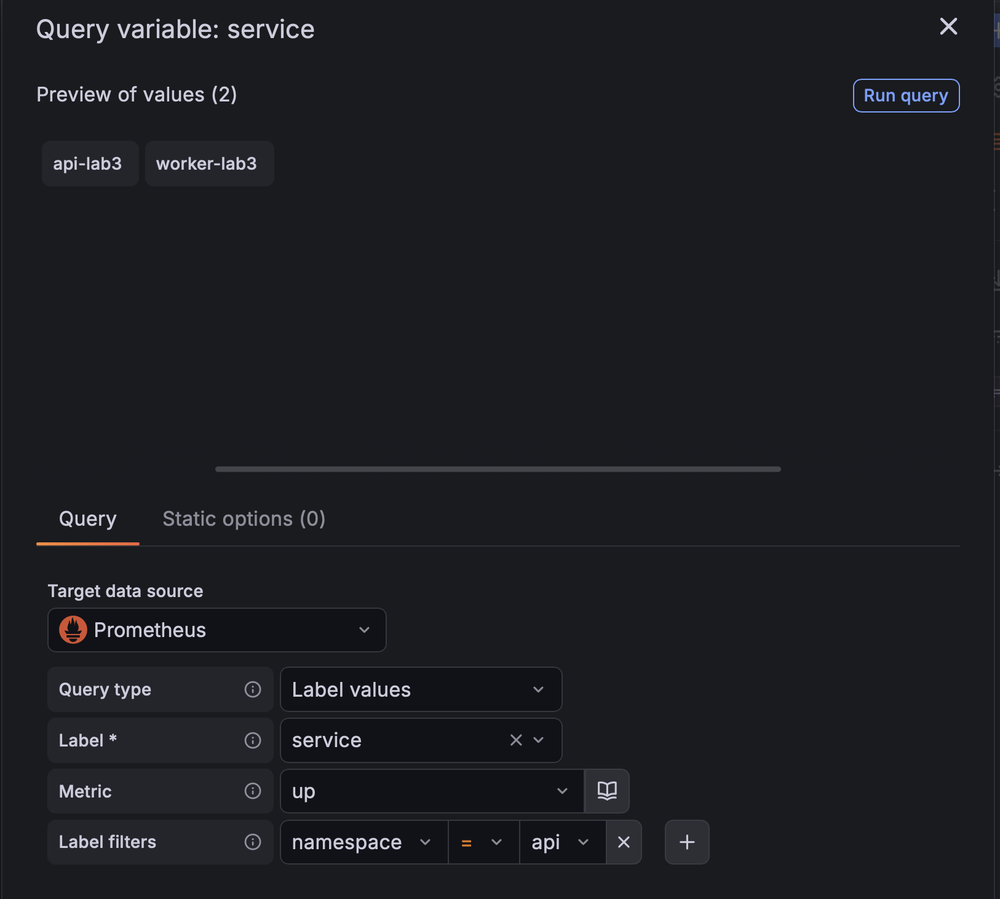

Ну и алертики всё ещё сыпятся в телеграм, вот пример для новых сервисов:

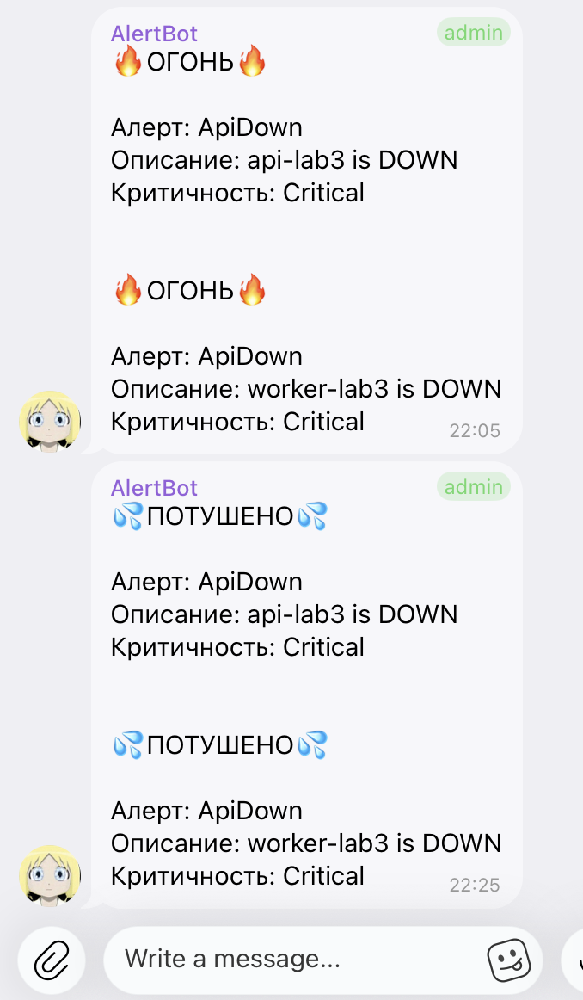

<a id="conclusions"></a>
## 6. Выводы
В ходе работы были настроены политики безопасности, часть из которых пришлось откатить, дабы что-то работало.
Интересно было поработать с разными полиси Kyverno, но их язык выражений довольно неприятный.

Из-за внедрения cosign и ручного деплоя пришлось пока использовать теги latest для API, дабы не прописывать вручную дайджест постоянно. Нехорошая практика, но вот так вот сделано в учебных целях.

Был доделан мониторинг для нормального переиспользования. По идее, теперь его можно будет не трогать до конца предмета.
