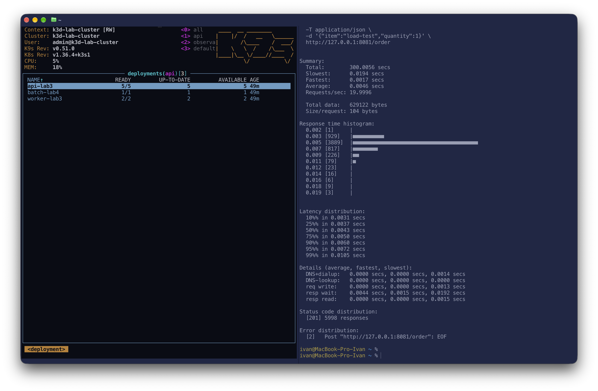
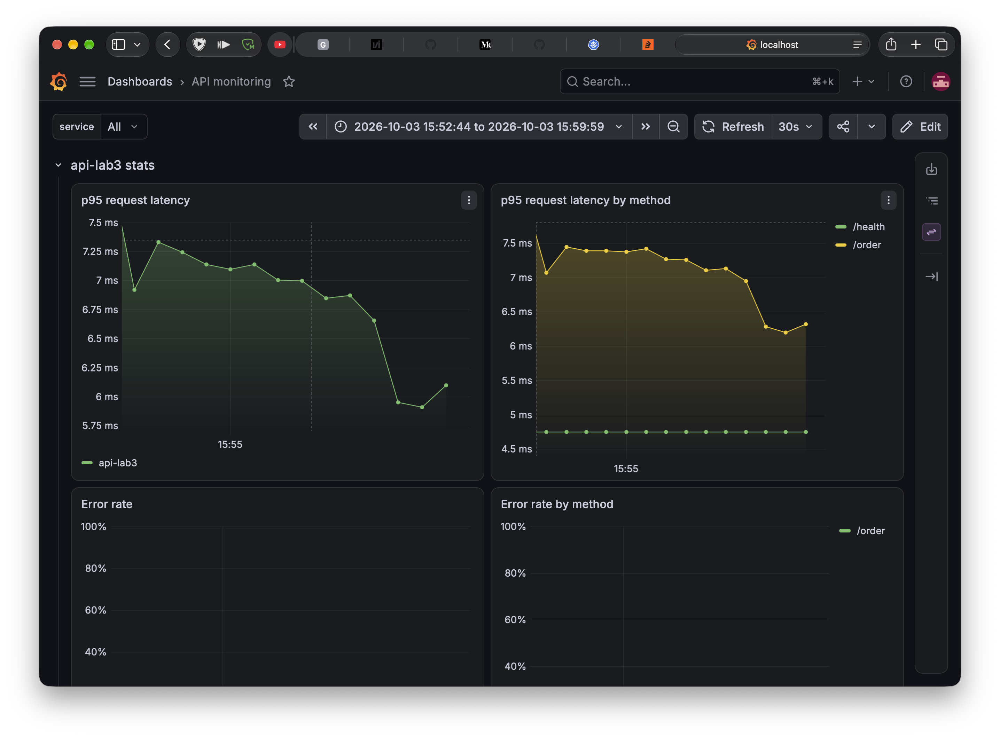
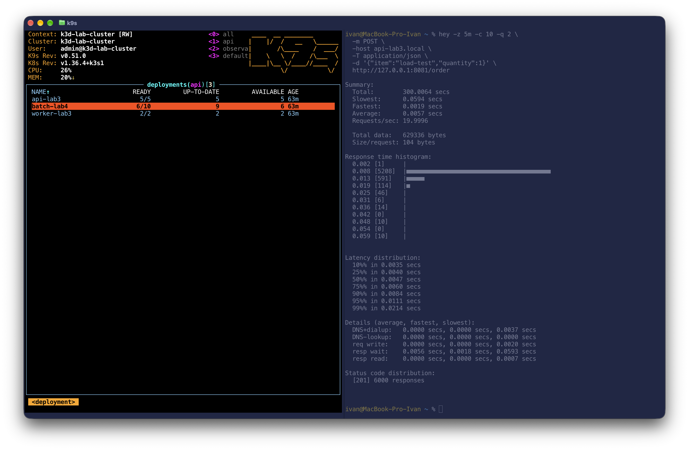
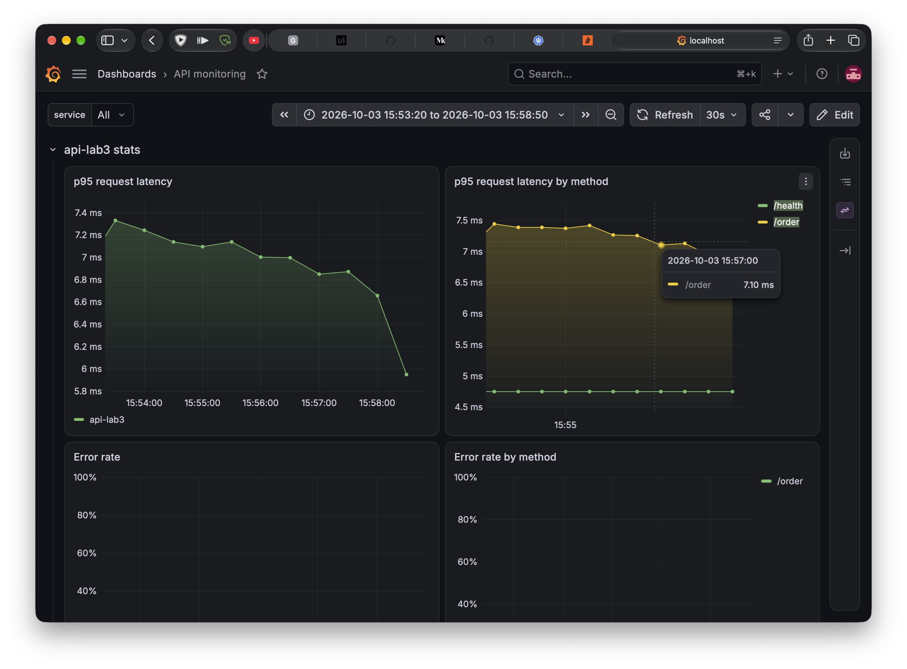
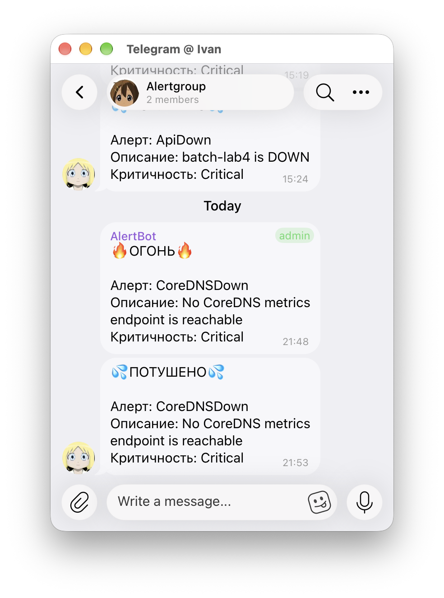

# Отчёт по лабораторной работе № 4

## Оглавление

0. [Подготовка batch-сервиса](#batch)
1. [Выбор механизма распределения подов](#spreading)
2. [Кластер с дефицитом ресурсов](#tight-cluster)
3. [Подбор ресурсов с помощью KRR](#krr)
4. [Распределение API по нодам](#api-spreading)
5. [Приоритеты и гарантии доступности](#priorities)
6. [Дефицит ресурсов и preemption](#preemption)
7. [Memory pressure и порядок eviction](#memory-pressure)
8. [Проверка SLA под нагрузкой](#sla)
9. [Алерты](#alerts)
10. [Выводы](#conclusions)

<a id="batch"></a>
## 0. Подготовка batch-сервиса

Опять наиислопленное приложение на Go. Добавлено в CI дабы билдилось и подписывалось. 

<a id="spreading"></a>
## 1. Выбор механизма распределения подов
На выбор было два механизма распределения подов: `podAntiAffinity` и `topologySpreadConstraints`

`podAntiAffinity` и `podAffinity` скорее задают, с какими подами должен/не должен соседствовать выбранный под. 
Это может понадобиться чтобы экземпляр находился на той же ноде, где и сервис, с которым он взаимодействует. 
Или наоборот, отделить под от "шумных" соседей. 

`topologySpreadConstraints` Больше подходит под наши задачи.
Он скорее описывает, как распределять поды по кластеру.
Например можно настроить равномерное распределение по нодам в соответствии с их регионом. 

Для тестирования `topologySpreadConstraints` я навесил на ноды лейблы `topology.kubernetes.io/region` со значениями us и eu.


Добавим в чарт возможность задавать topologySpreadConstraints и навесим на api-lab3 следующие параметры

```
topologySpreadConstraints:
  - maxSkew: 1
    topologyKey: topology.kubernetes.io/region
    whenUnsatisfiable: DoNotSchedule
    labelSelector:
      matchLabels:
        app.kubernetes.io/component: api
        app.kubernetes.io/part-of: shop
        app.kubernetes.io/lab: lab3
    matchLabelKeys:
      - pod-template-hash
```

Они означают, что поды должны быть равномерно распределены между нодами разных регионов. 
Максимальная разница кол-ва между регионами задана параметром  `maxSkew`

В распоряжении имеется кластер с двумя нодами, это значит, что без танцев с бубном данный механизм не проверить.

Потому поступим следующим образом:
- раскатим две реплики api-lab3 строго на разных нодах
- закордоним одну из нод, чтобы на ней нельзя было шедулить
- поднимем кол-во реплик api-lab3

Таким образом, реплики не могут быть зашедулены на вторую ноду и в какой-то момент будет нарушено условие `maxSkew`

Исходное состояние: 


После описанных манипуляций


На скриншоте видно, что после поднятия кол-ва реплик до 5 успешно зашедулилась только одна пода. 
Остальные находятся в состоянии pending, потому что невозможно в текущий момент удовлетворить требованиям `maxSkew`

```
Warning  FailedScheduling  73s   
default-scheduler  0/2 nodes are available:
1 node(s) didn't match pod topology spread constraints,
```

<a id="tight-cluster"></a>
## 2. Кластер с дефицитом ресурсов
Добавил по аналогии с прошлыми работами в [helmfile](../helmfile/helmfiles/shop.yaml.gotmpl) релиз batch. 

Использовался тот же универсальный чарт. 

<a id="krr"></a>
## 3. Подбор ресурсов с помощью KRR

Для симуляции нагрузки использовал `hey`, потому что он попроще, желания с js кодом возиться было мало. 

`KRR` - утилита, которая на основе метрик куба рассчитывает рекомендуемые лимиты и реквесты для отдельных приложений. 

Для полноценной работы я включил в kube-prom-stack `kubernetesServiceMonitors`, чтобы собирались нужные метрики

```
container_cpu_usage_seconds_total
container_memory_working_set_bytes
kube_replicaset_owner
kube_pod_owner
kube_pod_status_phase
```

KRR буду использовать в CLI режиме, для доступа к prometheus прокинул порты на локаль.

Использовались следующие аргументы

```
 krr simple -n api \
  --history-duration 1 \
  --timeframe-duration 0.25 \
  --points-required 30 -p http://127.0.0.1:9090
```

В них указано, что надо анализировать ns api алгоритмом simple ([ссылка](https://github.com/robusta-dev/krr#algorithm) как считается) и снижен диапазон анализируемых данных. По умолчанию анализируется интервал в 2 недели и требуется 30 точек с интервалом 1.25 минут. 

Результат работы krr:


Из интересного: совет убрать лимиты CPU. 
Это позволяет приложениям использовать свободные ресурсы при их наличии. 
При этом, в отличие от памяти, при сверх-использовании cpu времени приложения продолжат работу, но в зависимости от указанных request будет распределяться имеющееся время процессора.

Указанные рекомендации были применены, но CPU лимиты оставлены, так как это требуется для лабораторной работы. 

<a id="api-spreading"></a>
## 4. Распределение API по нодам
Механизм распределения api по нодам был рассмотрен в первой главе. 
Он позволяет добиться доступности при отказе отдельных нод. 
Например, если брать пример с распределением на основе региона, 
то при отказе ДЦ облачного провайдера в одном из регионов, api все еще будет доступна с нод в другом ДЦ. 


<a id="priorities"></a>
## 5. Приоритеты и гарантии доступности
`PodDisruptionBudget` по сути позволяет указать, либо сколько подов будет минимально доступно, либо сколько подов максимально недоступно. 

Была [добавлена возможность](../helmfile/charts/api-universal/templates/podDisruptionBudget.yaml) прописать в чарте обе политики. 

Для api, worker, batch указал, что всегда должен быть доступен хотя бы один под
```
podDisruptionBudget:
  enabled: true
  budgetType: minAvailable
  podCount: 1
```

При этом стоит учитывать, что при необходимости механизмы `PriorityClass` (будет настроен далее) могут нарушать `podDisruptionBudget`. 
Например когда без этого нельзя разместить более приоритетный под. 

`PriorityClass` позволяет указать приоритетность конкретных подов для шедулера. Для гарантии более приоритетным подам размещения используется механизм `preemption`, который в зависимости от настройки позволяет вытеснять менее приоритетные поды. 

Добавим [шаблон](../helmfile/charts/api-universal/templates/priorityClass.yaml) `PriorityClass` в чарт с автоматическим прокидыванием в Deployment. 
```
	{{- if .Values.priorityClass.enabled }}
	priorityClassName: {{ include "api.priorityClassName" . }}
	{{- end }}
```

Укажем для api, воркера и постгри следующие параметры
```
priorityClass:
  enabled: true
  value: 100000
  globalDefault: false
  preemptionPolicy: PreemptLowerPriority
  description: High priority for the critical API path
```
`preemptionPolicy: PreemptLowerPriority` указывает на вытеснение подов с меньшим приоритетом. 

Для batch зададим куда более низкий приоритет и запретим вообще хоть кого-то вытеснять

```
priorityClass:
  enabled: true
  value: -1000
  globalDefault: false
  preemptionPolicy: Never
  description: Low priority for expendable batch workloads
```

<a id="preemption"></a>
## 6. Дефицит ресурсов и preemption
Проверим механизм в действии. С целью тестирования завысим реквесты до двух cpu на один экземпляр и зададим кучу реплик. 

Исходное состояние:


Пока и api, и batch спокойно помещаются в кластере. Поднимем кол-во реплик api до 10 и проверим ,что станет с batch

Можно увидеть, что для освобождения ресурсов были ликвидированы все поды batch. 
В ивентах можно отчетливо видеть причину: 
```
Events:
  Type     Reason            Age   From               Message
  ----     ------            ----  ----               -------
  Warning  FailedScheduling  75s   default-scheduler  0/2 nodes are available: 
	2 Insufficient cpu. no new claims to deallocate, preemption: not eligible due to preemptionPolicy=
Never.
```

При этом доступно ноль подов batch, что говорит о нарушении политики `podDisruptionBudget`ради размещения более приоритетного сервиса. 

<a id="memory-pressure"></a>
## 7. Memory pressure и порядок eviction
Искусственно поднимем реквесты до 2 гигабайт ОЗУ и увеличим кол-во реплик.
Повторим аналогичные манипуляции как с cpu

Исходное положение:


Поднимем кол-во реплик api


Видно, что два пода batch были УБИТЫ OOM и теперь новые не могут зашедулиться. 
Причину ошибки можно посмотреть в ивентах:

```
Events:
  Type     Reason            Age   From               Message
  ----     ------            ----  ----               -------
  Warning  FailedScheduling  35s   default-scheduler  0/2 nodes are available: 
  2 Insufficient memory. no new claims to deallocate, preemption: not eligible due to preemptionPol
icy=Never.
```

<a id="sla"></a>
## 8. Проверка SLA под нагрузкой
Посмотрим в нормальных условиях какая задержка, потом будем ЖОСКО поднимать кол-во подов batch и смотреть,
что этот сосед не мешает никак api.

Проверим, какое время ответа без повышенной нагрузки со стороны batch. Нагрузим api в течение 5 минут. 




Судя по графикам, средняя p95 latency где-то в районе 7мс

Теперь увеличим кол-во реплик batch пока не упремся в лимиты и запустим аналогичную нагрузку на api.
При увеличении реплик до 10, 4 остались в статусе `Pending`



Посмотрим в events почему так произошло. 

```
Events:
  Type     Reason            Age   From               Message
  ----     ------            ----  ----               -------
  Warning  FailedScheduling  12s   default-scheduler  0/2 nodes are available: 2 Insuffi
cient memory. no new claims to deallocate, preemption: not eligible due to preemptionPolicy=Never.
```

По ошибке видно, что поды batch не шедулятся, потому что ресурсы нужны под api, которая имеет более высокий приоритет
и политику, позволяющую вытеснять другие поды. 

Проверим время ответа в grafana. 



По графикам видно, что 95-й персентиль по времени ответа остался примерно на том же уровне. 

<a id="alerts"></a>
## 9. Алерты
Были добавлены следующие [алерты](../helmfile/releases/monitoring-resources/values.yaml) (группа cluster-alerts)
- NodeNotReady: если нода кластера по какой-либо причине не готова принимать ресурсы. 
- Отвал CoreDNS  и APIserver: говорят о проблемах с кластером. Критичные алерты, так как напрямую влияют на работу приложений внутри кластера.

Так же поднял количество реплик объектов мониторинга и прописал им параметры `topologySpreadConstraints`.
Это нужно чтобы при падении одной ноды мониторинг продолжал работать. 

Пример работающего алерта для CoreDNS



<a id="conclusions"></a>
## 10. Выводы
Честно говоря не знаю, что написать в выводах. 
Интересно было krr на работе потыкать, полезная тузла, которая еще и раобтает на стороне клиента. 

Могу рассказать, что при одной из попыток проверить доступность ресурсов для api с фоновой нагрузкой, упал сам мониоринг.
Но главное, что API держался.

При добавлении новый алертов понял, что текущая схема деплоя алертов всратенькая,
потому что вместе с api деплоятся все алерты, в том числе и инфровые. 
Вторые явно должны просто существовать всегда. 
Так же надо что-то сделать с шаблоном. Либо нормально делать его универсальным, либо через разных 
ресиверов добавлять разные шаблоны под разные типы алертов. 
Сейчас как-то костыльно. К этим моментам надо будет вернуться в слдующих лабах.