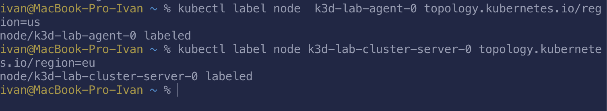
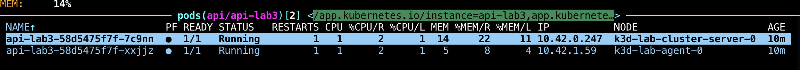
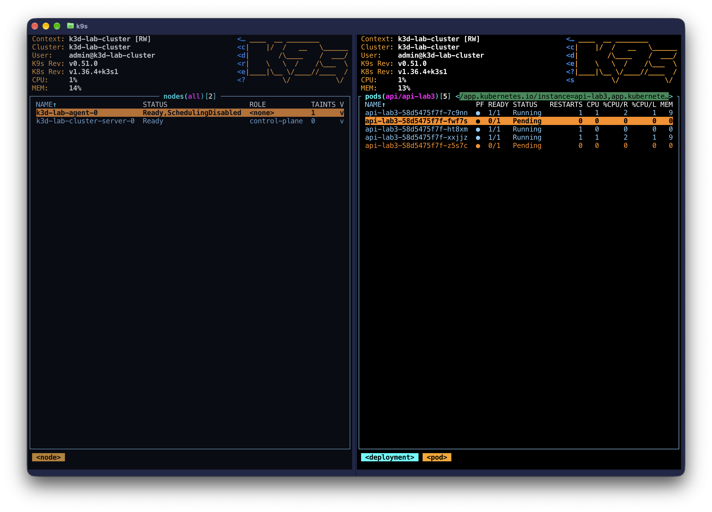
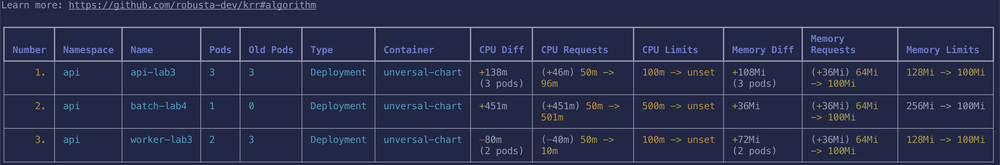
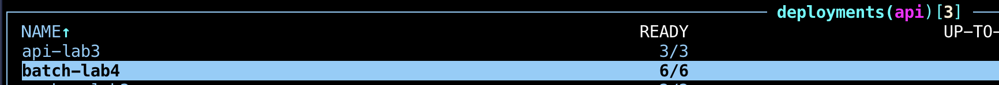
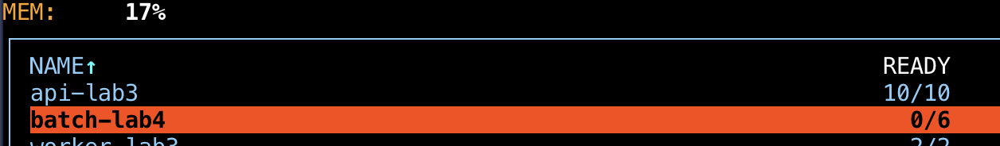
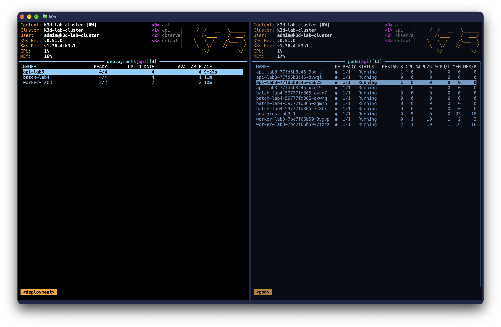
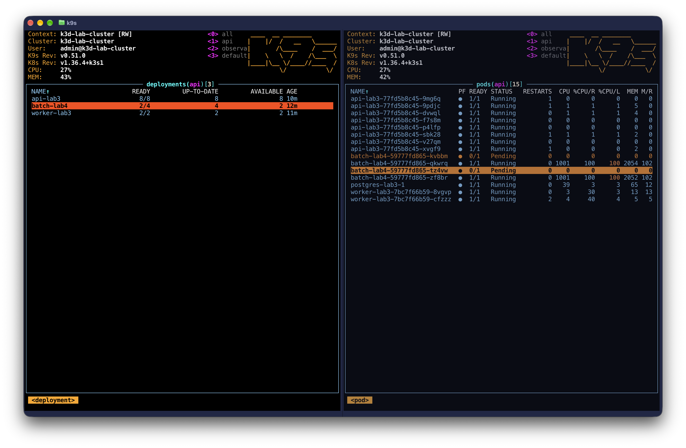

# Отчёт по лабораторной работе № 4

## Оглавление

0. [Подготовка batch-сервиса](#batch)
1. [Выбор механизма распределения подов](#spreading)
2. [Кластер с дефицитом ресурсов](#tight-cluster)
3. [Подбор ресурсов с помощью KRR](#krr)
4. [Распределение API по нодам](#api-spreading)
5. [Приоритеты и гарантии доступности](#priorities)
6. [Дефицит ресурсов и preemption](#preemption)
7. [Memory pressure и порядок eviction](#memory-pressure)
8. [Проверка SLA под нагрузкой](#sla)
9. [Мониторинг и оповещения](#monitoring)
10. [Выводы](#conclusions)

<a id="batch"></a>
## 0. Подготовка batch-сервиса

Опять наиислопленое приложение на Go. Добавлено в CI дабы билдилось и подписывалось. 

<a id="spreading"></a>
## 1. Выбор механизма распределения подов
На выбор было два механизма распределения подов: `podAntiAffinity` и `topologySpreadConstraints`

`podAntiAffinity` и `podAffinity` скорее задают, с какими подами должен/не должен соседствовать выбранный под. 
Это может поднадобиться чтобы экземплря находился на той же ноде, где и сервис, с которым он взаимодействует. 
Или наоброт, отделить под от "шумных" соседей. 

`topologySpreadConstraints` Больше подходит под наши задачи.
Он скорее описывает, как распределять поды по кластеру.
Например можно настроит равномерное распределение по нодам в соотвествии их региону. 

Для тестирования `topologySpreadConstraints` я навесил на ноды лейблы `topology.kubernetes.io/region` со значениями us и eu.



Добавим в чарт возможность задавать topologySpreadConstraints и навеим на api-lab3 следующие параметры

```
topologySpreadConstraints:
  - maxSkew: 1
    topologyKey: topology.kubernetes.io/region
    whenUnsatisfiable: DoNotSchedule
    labelSelector:
      matchLabels:
        app.kubernetes.io/component: api
        app.kubernetes.io/part-of: shop
        app.kubernetes.io/lab: lab3
    matchLabelKeys:
      - pod-template-hash
```

Они означают, что между ноды поды должны быть равномерно распределены между нодами разных рагионов. 
Максимальная разница колва между регионами задана параметром  `maxSkew`

В распоряжении имеется кластер с двумя нодами, это значит, что без танцев с бубном данных механизм не проверить.

Потому поступим следующим образом:
- раскатим две реплики api-lab3 строго на разных нодах
- закордоним одну из нод, чтобы на не. нельзя было шедулить
- поднимем кол-во реплик api-lab3

Таким образом, реплики не могут быть зашедулены на вторую ноду и в какой-то момент будет нарушено условие `maxSkew`

Исходной состояний: 


После описаныхх манипуляций


На скриншоте видно, что после поднятия кол-ва реплик до 5 успешно зашедулилась только одна пода. 
Остальные находятся в состоянии pending, потому что невозможно в текущий момент удовлетворить требованиям `maxSkew`

```
Warning  FailedScheduling  73s   
default-scheduler  0/2 nodes are available:
1 node(s) didn't match pod topology spread constraints,
```

<a id="tight-cluster"></a>
## 2. Кластер с дефицитом ресурсов
Добавил по аналогии с прошлымр работами в [helmfile](../helmfile/helmfiles/shop.yaml.gotmpl) релиз batch. 

Использовался тот же универсальный чарт. 

<a id="krr"></a>
## 3. Подбор ресурсов с помощью KRR

Для симуляции нагрузки исопльзовал `hey`, потому что он попроще, желания с js кодом возиться было мало. 

`KRR` - утилита, которая на основе метрик куба рачитывает рекомендуемые лимиты и реквесты для отдельных приложений. 

Для полноценной работы я включил в kube-prom-stack `kubernetesServiceMonitors`, чтобы собирались нужные метрики

```
container_cpu_usage_seconds_total
container_memory_working_set_bytes
kube_replicaset_owner
kube_pod_owner
kube_pod_status_phase
```

KRR буду использовать в CLI режиме, для доступа к prometheus прокинул порты на локаль.

Использовались следующие аргументы

```
 krr simple -n api \
  --history-duration 1 \
  --timeframe-duration 0.25 \
  --points-required 30 -p http://127.0.0.1:9090
```

В них указано, что надо аналиировать ns api алгоритмом simple ([ссылка](https://github.com/robusta-dev/krr#algorithm) как считается) и снижен диапазон анализируемых данных. По умолчанию анализируется интервал в 2 недели и требуется 30 точек с интервалом 1.25 минут. 

Результат работы krr:


Из интересного: совет убрать лимиты CPU. 
Это позволяет приожения исползовать свободные ресурсы при их наличии. 
При этом, в отличии от памяти, при сверх-использовании cpu времени приложения продолжат работу, но в зависимости от указанных request будет распределяться имеящееся время процсессора.

Указанные рекомендации были применены, но CPU лимиты оставлены, так как это требуется для лабораторной работы. 

<a id="api-spreading"></a>
## 4. Распределение API по нодам
Механизм распределения api по нодам был рассмотрен в первой главе. 
Он позволяет добиться доступности при отказе отдельных нод. 
Например, если брать пример с распределением на основе региона, 
то при отказе ДЦ облачного провайдера в одном из регионов, api все еще будет доступна с нод в другом ДЦ. 


<a id="priorities"></a>
## 5. Приоритеты и гарантии доступности
`PodDisruptionBudget` по сути позволяет указать, либо сколько подов будет минимально доступно, либо сколько подом максмально недоступно. 

Была [добавлена возможность](../helmfile/charts/api-universal/templates/podDisruptionBudget.yaml) прописать в чарте обе политики. 

Для api, worker, batch указал, что всегда должен быть доступен хотя бы один под
```
podDisruptionBudget:
  enabled: true
  budgetType: minAvailable
  podCount: 1
```

При этом стоит учитывать, что при необходимости механизмы `PriorityClass` (будет настроен далее) могут нарушать `podDisruptionBudget`. 
Например когда без этого нельзя разместить более приоритетный под. 

`PriorityClass` позволяет указать приоритетность конкретных подов для шедулера. Для гарантии более приортетным подам размешения используется механизм `preemption`, который в зависимости от настройки позволяет вытеснять менее приоритетные поды. 

Добавим [шаблон](../helmfile/charts/api-universal/templates/priorityClass.yaml) `PriorityClass` в чарт с автоматическим прокидыванием в Deployment. 
```
	{{- if .Values.priorityClass.enabled }}
	priorityClassName: {{ include "api.priorityClassName" . }}
	{{- end }}
```

Укажем для api, воркер и постгри следующие параметры
```
priorityClass:
  enabled: true
  value: 100000
  globalDefault: false
  preemptionPolicy: PreemptLowerPriority
  description: High priority for the critical API path
```
`preemptionPolicy: PreemptLowerPriority` указывает на вытеснение подов с меньшим приоритетом. 

Для batch зададим куда более низкий приоритет и запретим вообще хоть кого то вытеснять

```
priorityClass:
  enabled: true
  value: -1000
  globalDefault: false
  preemptionPolicy: Never
  description: Low priority for expendable batch workloads
```

<a id="preemption"></a>
## 6. Дефицит ресурсов и preemption
Проверим механизм в действии. С целью тестирования завысим реквесты до двух cpu на один экземпляр и зададим кучу реплик. 

Исходной состояние:


Пока и api, и batch спокойно помещаются в кластере. Поднимем кол-во реплик api до 10 и проверим ,что станет с batch

Можно увидеть, что для освобождения ресурсов были ликвидированы все поды bacth. 
В ивентах можно отчетливо видеть причину: 
```
Events:
  Type     Reason            Age   From               Message
  ----     ------            ----  ----               -------
  Warning  FailedScheduling  75s   default-scheduler  0/2 nodes are available: 
	2 Insufficient cpu. no new claims to deallocate, preemption: not eligible due to preemptionPolicy=
Never.
```

При этом доступно ноль подов batch, что говорит о наружении политики `podDisruptionBudget`ради размещения более приоритетного сервиса. 

<a id="memory-pressure"></a>
## 7. Memory pressure и порядок eviction
Искусствено поднимим реквесты до 2 гигабут ОЗУ и увеличим кол-во реплик.
Повторим аналогичные манипуляции как с cpu

Исходной положение:


ПОднимим кол-во реплик api


Видно, что два пода batch были УБИТЫ OOM и теперь новые не могут зашедулится. 
Причину ошибки можно посмотреть в ивентах:

```
Events:
  Type     Reason            Age   From               Message
  ----     ------            ----  ----               -------
  Warning  FailedScheduling  35s   default-scheduler  0/2 nodes are available: 
  2 Insufficient memory. no new claims to deallocate, preemption: not eligible due to preemptionPol
icy=Never.
```

<a id="sla"></a>
## 8. Проверка SLA под нагрузкой


<a id="monitoring"></a>
## 9. Мониторинг и оповещения

<a id="conclusions"></a>
## 10. Выводы
